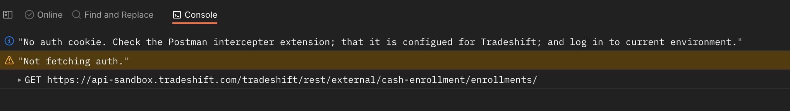

# Postman Interceptor setup

Postman interceptor is a Chrome extension that will sync up cookies from selected domains with Postman.
This can be useful to always have your latest login auth cookie, so Postman can fetch your auth tokens for request.

- make sure Postman is up to date ~10.12.10
- [download and install the extension](https://chrome.google.com/webstore/detail/postman-interceptor/aicmkgpgakddgnaphhhpliifpcfhicfo?hl=en)
- whitelist selected domains in extension and turn on cookie capture
	- 
-  Open the 'cookies' menu and navigate to the 'Sync' tab
	- 
	- Make sure that Interceptor is marked as connected and syncing.
		- add in tradeshift domains to the domains multi-select
		- 
	- Once that is set up any time you login to a tradeshift domain your cookies will be synced with Postman
	- Now select your environment you want to use.
		  
	- A pre-request script was added to the 'Tradeshift' collection.
		- 
		- Any collection under 'Tradeshift' wil run this script
		- This script will check for a valid environment and Auth cookie then will fetch an auth bearer token. The script only runs once a minute unless your cookie changes. 
        - 

 - If facing any issues, please check the console for any errors.
    - Should be plenty of logs to help you debug.
    - 
    

A note on the environments - I believe these are global, so we may end up sharing tokens between users. I am not 100% on this. It may be good for us to look into how we can access variables local to our machine, but in the meantime, this should work.