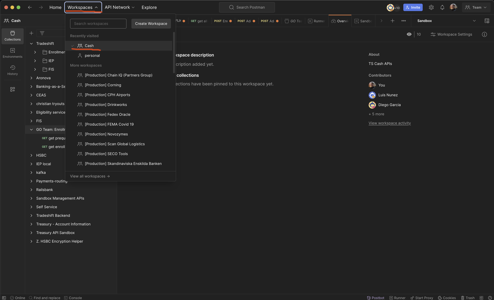
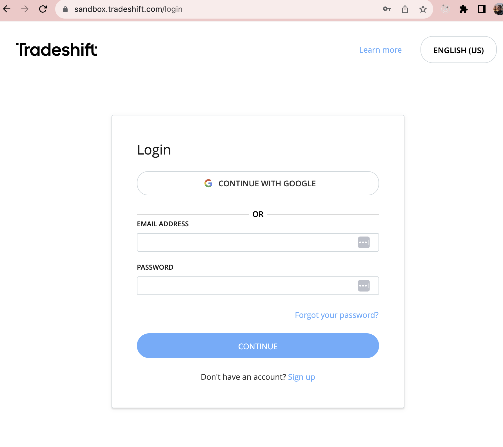

# Postman Interceptor Setup

Postman Interceptor is a Chrome extension that syncs up cookies from selected domains with Postman. This can be useful to always have your latest login auth cookie, so Postman can fetch your auth tokens for requests.

## Prerequisites
- Ensure that Postman is up to date (version ~10.12.10).

## Installation
1. Download and install the [Postman Interceptor extension](https://chrome.google.com/webstore/detail/postman-interceptor/aicmkgpgakddgnaphhhpliifpcfhicfo?hl=en) from the Chrome Web Store.
2. Ensure that Interceptor is marked as connected and syncing. (see image below)
	
	- Open the Cookies menu and navigate to the Sync tab.
  - Install the interceptor bridge if not installed
	- Any time you log in to a Tradeshift domain, your cookies will be synced with Postman.
	
3. Whitelist selected domains in the extension and turn on cookie capture: (see image below)
	-
	- Open the extension settings and select the "Cookies" tab.
	- Add in the Tradeshift domains to the domains multi-select.
	- Turn on cookie capture (press 'sync cookies).
4. Add the same selected domains to the Domains Allowlist.
    	- Open the Cookies menu and navigate to the Manage Cookies tab.
       	- Click the Domains Allowlist Button (see image below)
   	- Add the same domains from cookie capture extenstion tab to the Domain Allowlist inside of postman
	- This allows cookies captured from the extension to be used inside of postman scripts
      		
      		
5. Select a environment in the Cash workspace:
    	- Select the Cash workspace
    	
	- Select your desired environment.
	
6. Log in to desired environment:
	- if you selected sandbox in the environment dropdown then log in to sandbox.
    	
	- Pre-request script
		- A pre-request script was added to the 'Tradeshift' collection.
		- This script will check for a valid environment and auth cookie, then will fetch an auth bearer token.
		- The script only runs once a minute unless your cookie changes.
			
			
7. Make requests from the Tradeshift collection in the Cash workspace in postman.
	- Authentication tokens will automatically be handled by postman andpostman interceptor for the selected environment.
  	- Make sure you are logged in to the correct environment. 

## Troubleshooting
- If facing any issues, please check the console for any errors. There should be plenty of logs to help you debug.
- If cookies are not syncing - log out of tradeshift, restart chrome, and restart postman. Then log back into the correct env on tradeshift.

## Note on Environments
The environments are global, so we may end up sharing tokens between users. We may need to look into how we can access variables local to our machine, but in the meantime, this setup should work.
